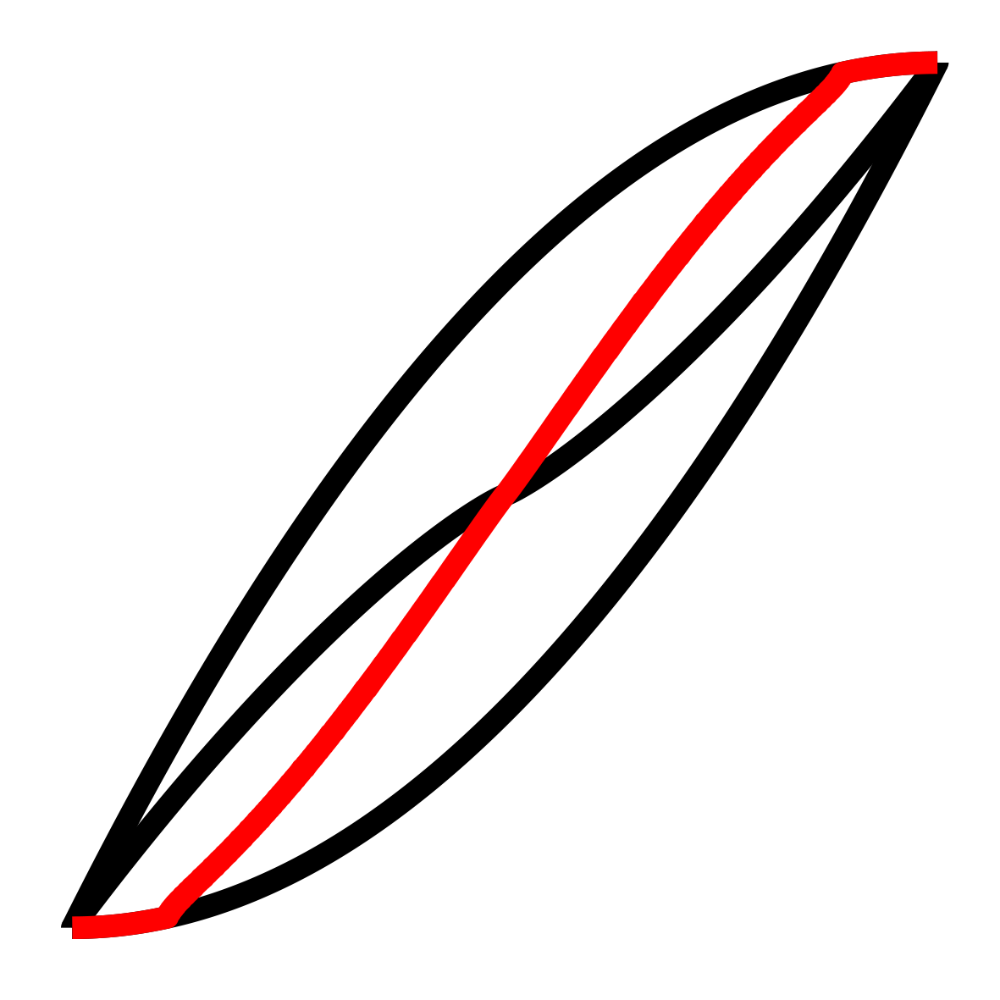
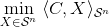
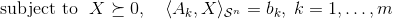

<!-- README.md is generated from README.Rmd. Please edit that file -->

```{r, echo = FALSE}
knitr::opts_chunk$set(
  collapse = TRUE,
  comment = "#>",
  fig.path = "README_figures/"
)
```

```{r load-pkgs, include=FALSE}
library(symconivol)
library(tidyverse)
```

# symconivol: An R package for curvature measures of symmetric cones

This R package provides functions for analyzing the curvature measures of symmetric cones.

## Installation

You can install `symconivol` from github with:

```{r gh-installation, eval = FALSE}
# install.packages("devtools")
devtools::install_github("damelunx/symconivol")
```

## Code & documentation

* Source code: [github.com/damelunx/symconivol](http://github.com/damelunx/symconivol)
* Manual: [damelunx.github.io/symconivol](http://damelunx.github.io/symconivol)

**See also:**

* `conivol` package: [damelunx.github.io/conivol](http://damelunx.github.io/conivol)

## Motivation

Intrinsic volumes form interesting and useful characteristics of convex cones.
The cones of positive semidefinite matrices have an additional property, which
is its decomposition into the rank strata. This decomposition lead to a decomposition
of its intrinsic volumes into the so-called curvature measures. These curvature
measures can be studied through the eigenvalue distribution of the
[Gaussian orthogonal/unitary/symplectic ensemble](https://en.wikipedia.org/wiki/Random_matrix).
The functions provided by this package facilitate studying this connection.
See the accompanying vignette for such a study.

One application of the curvature measures is that they can be used for understanding
the distribution of the rank of the solution of a random
[semidefinite program](https://en.wikipedia.org/wiki/Semidefinite_programming).
Concretely, if the semidefinite program is of the form

>   
> 

that is, the SDP optimizes a linear functional over the intersection of the
cone of positive semidefinite matrices with an affine linear subspace of
(generically) codimension $m$, then the rank of the solution (assuming that the SDP has
a solution) can be predicted by:

```{r pred_sol}
n <- 30
m <- 150
pat <- pat_bnd(1,n)
d <- pat$d
pred_rank_sol <- round(n*mu()$lkup_rho(m/d))
print(pred_rank_sol)
```

See the corresponding [section](articles/curv_meas.html#appl_SDP)
in the accompanying vignette for more details.

A more precise estimate of the rank probabilities of the solution of a random
SDP is provided through the function `SDP_rnk_pred`:
```{r SDP_rnk_pred}
SP <- SDP_rnk_pred(30,150)

print(SP$P)
print(SP$bnds)
print(SP$plot)
```


