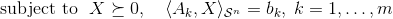

<!-- README.md is generated from README.Rmd. Please edit that file -->
symconivol: An R package for curvature measures of symmetric cones
==============================================================================================================================

This R package provides functions for analyzing the curvature measures of symmetric cones.

Installation
------------

You can install `symconivol` from github with:

``` r
# install.packages("devtools")
devtools::install_github("damelunx/symconivol")
```

Motivation
----------

Intrinsic volumes form interesting and useful characteristics of convex cones. The cones of positive semidefinite matrices have an additional property, which is its decomposition into the rank strata. This decomposition lead to a decomposition of its intrinsic volumes into the so-called curvature measures. These curvature measures can be studied through the eigenvalue distribution of the [Gaussian orthogonal/unitary/symplectic ensemble](https://en.wikipedia.org/wiki/Random_matrix). The functions provided by this package facilitate studying this connection. See the accompanying vignette for such a study.

One application of the curvature measures is that they can be used for understanding the distribution of the rank of the solution of a random [semidefinite program](https://en.wikipedia.org/wiki/Semidefinite_programming). Concretely, if the semidefinite program is of the form

> 
> 

that is, the SDP optimizes a linear functional over the intersection of the cone of positive semidefinite matrices with an affine linear subspace of (generically) codimension *m*, then the rank of the solution (assuming that the SDP has a solution) can be predicted by:

``` r
n <- 30
m <- 150
pat <- pat_bnd(1,n)
d <- pat$d
pred_rank_sol <- round(n*mu()$lkup_rho(m/d))
```

See the corresponding [section](articles/curv_meas.html#appl_SDP) in the accompanying vignette for more details.

A more precise estimate of the rank probabilities of the solution of a random SDP is provided through the function `SDP_rnk_pred`:

``` r
SP <- SDP_rnk_pred(30,150)

print(SP$P)
#> # A tibble: 31 x 2
#>     `k=` `Prob(rk_sol=k)=`
#>    <int>             <dbl>
#>  1     0          0.      
#>  2     1          0.      
#>  3     2          0.      
#>  4     3          0.      
#>  5     4          0.      
#>  6     5          0.      
#>  7     6          9.45e-33
#>  8     7          7.99e-19
#>  9     8          4.09e-10
#> 10     9          9.50e- 5
#> # ... with 21 more rows
print(SP$bnds)
#> [1]  6 16
print(SP$plot)
```


